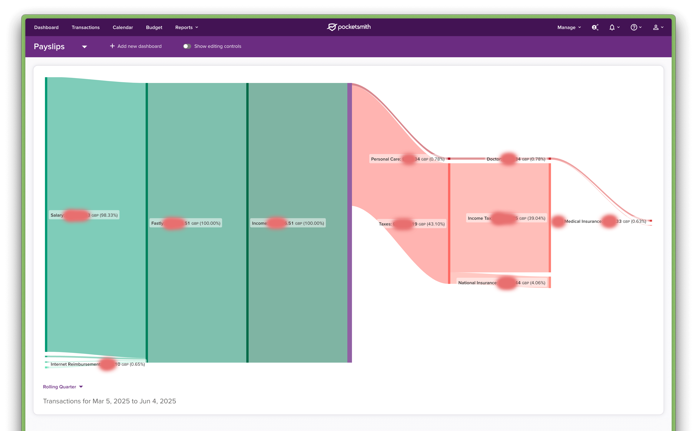

# Payslip Importer

This script imports "interactive payslips" generated by [Zedra](https://www.zedra.com/) Payroll into [PocketSmith](https://www.pocketsmith.com/) in order to allow you to track your earnings and deductions just like you would with any other income or expense.

I do NOT recommend using this unless you are a confident developer and understand how the tool works, as any mistakes could result in incorrect financial records.



## Prerequisites

- A PocketSmith transaction account set up as a payroll account (e.g. "My Company PAYE"). This holds the transactions imported from your payslips as well as the final take-home pay transfer to your bank account.
- A PocketSmith transaction account set up for your bank account (e.g. "My Bank Account"). This is where the final take-home pay will be transferred to.
- PocketSmith categories for every line item in your payslip. For example, you might have categories for "Salary", "Tax", "National Insurance", "Medical Insurance", etc. These do not need to match the names in your payslip as you can map them in the configuration file.

### Script Usage

1. Extract your interactive payslip from the Zedra payroll portal as JSON and save it to `payslip.json` in the root directory of this project. **If you can't figure out how to do this then please stop here.**
2. Copy `config.example.json` to `config.json` and fill in your PocketSmith developer key, account name, payee names, and other settings:
    - `pocketSmithDeveloperKey`: Your PocketSmith developer key.
    - `transactionAccountName`: The name of the account in PocketSmith where the transactions will be imported.
    - `transactionsNeedReview`: Whether the transactions should be marked as needing review in PocketSmith.
    - `employerPayeeName`: The name of the employer. Used as the payee for the employer transactions.
    - `employeePayeeName`: The name of the payee that the final take-home pay will be attributed to.
    - `netPayCategory`: The category for the net pay transaction.
    - `payslipLineToCategoryNameMapping`: A map of payslip line names to PocketSmith category names. This allows you to categorize different types of earnings, deductions, etc.
3. Dry-run the script using `npm start < payslip.json` to verify that the output looks correct.
4. If everything looks good, run the script with `npm start -- --publish < payslip.json` to import the transactions into PocketSmith.

### Example Run

```bash
➜  pocketsmith-zedra-importer npm start < payslip.json

> pocketsmith-zedra-importer@1.0.0 start
> ts-node .

Making request to GET https://api.pocketsmith.com/v2/me

Looking for transaction account My PAYE...
Making request to GET https://api.pocketsmith.com/v2/users/512329/transaction_accounts
Transaction account: { id: 3463011, name: 'My PAYE' }

Mapping payslip categories to PocketSmith categories...
Making request to GET https://api.pocketsmith.com/v2/users/512329/categories
Generated category mapping: {
  'Phone Reimbursement GU': 20301412,
  'Internet Reimbursement GU': 20301415,
  'Internet Reimbursement NT': 20301415,
  'Gross up Tax and NI': 20301409,
  Salary: 20001406,
  Tax: 20301454,
  NI: 20301457,
  PMI: 20401469,
  'Dental Deduction': 20417297
}

Transactions to be imported:

[
  {
    payee: 'My Employer',
    amount: 40.47,
    date: '2025-05-30',
    is_transfer: false,
    category_id: 20301412,
    needs_review: true
  },
  {
    payee: 'My Employer',
    amount: 13327.94,
    date: '2025-05-30',
    is_transfer: false,
    category_id: 20001406,
    needs_review: true
  },
  {
    payee: 'My Employer',
    amount: -4168.07,
    date: '2025-05-30',
    is_transfer: false,
    category_id: 20301454,
    needs_review: true
  },
  {
    payee: 'My Employer',
    amount: -756.65,
    date: '2025-05-30',
    is_transfer: false,
    category_id: 20301457,
    needs_review: true
  },
  {
    payee: 'My Bank Account',
    amount: -8443.69,
    date: '2025-05-30',
    is_transfer: true,
    category_id: 19578150,
    needs_review: true
  }
]

Transactions ready for import. Use --publish to send them to PocketSmith.
